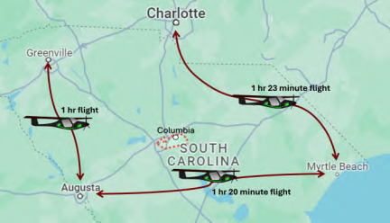

# Realistic-Southeastern-Flight-Operations-Data
Realistic Southeastern Flight Operations Data

Figure 1: Flight paths assembled in this repository along with their respective flight times.

## Licensing

[![CC BY-SA 4.0][cc-by-sa-shield]][cc-by-sa]

This work is licensed under a
[Creative Commons Attribution-ShareAlike 4.0 International License][cc-by-sa].

[cc-by-sa]: http://creativecommons.org/licenses/by-sa/4.0/
[cc-by-sa-image]: https://licensebuttons.net/l/by-sa/4.0/88x31.png
[cc-by-sa-shield]: https://img.shields.io/badge/License-CC%20BY--SA%204.0-lightgrey.svg

## Citation

#### IEEE
ARTS-Lab, Realistic Southeastern Flight Operations Data, GitHub. [Online]. Available: https://github.com/ARTS-Laboratory/Realistic-Southeastern-Flight-Operations-Data. Accessed: month, day, year.

#### Bibtex

@Misc{ARTSLabRealisticSoutheasternFlight,    
  author = {ARTS-Lab},  
  howpublished = {GitHub},  
  title  = {Realistic Southeastern Flight Operations Data},  
  groups = {ARTS-Lab},    
  url    = {https://github.com/ARTS-Laboratory/Realistic-Southeastern-Flight-Operations-Data},   
}

QR code for repo.

