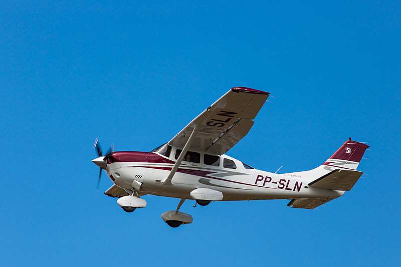

# Cessna 206

Figure 1: Cessna 206. [Joao Carlos Medau from Campinas, Brazil, CC BY 2.0, via Wikimedia Commons]

## Flight Profile Collection Process
There does not exist flight profiles for this class of aircraft in the SE US so we made some by:
... calculating the energy stored in the fuel through the fuel flow data available through flightdata.com
... then scaling that based on the engines efficiency at different points of the flight
... the efficiency during taxi and cruise is 30% and 19% during takeoff 

